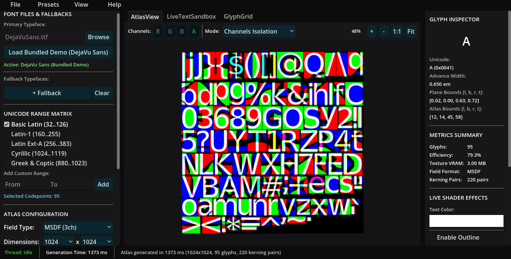

[](LICENSE)
[](https://godotengine.org)
[](https://isocpp.org)
[](https://github.com/sachinthankachan/msdf-atlas-studio/actions/workflows/build_and_release.yml)

<br><br><br>
<p align="center">
  
  
</p>
<h1 align = "center">MSDF Atlas Studio</h1><br>
<p align="center">
  
</p>

**MSDF Atlas Studio** is an open-source, high-performance desktop workstation for generating **Multi-channel Signed Distance Field (MSDF)** font texture atlases. Built with Godot 4 and C++ GDExtension, it wraps Viktor Chlumský's industry-standard `msdf-atlas-gen` and FreeType into an intuitive, responsive graphical studio.

---

## 🚀 Download Prebuilt Binaries

Portable, zero-installation executables are available for all major desktop platforms:

| Platform | Download Link | Details |
| :--- | :--- | :--- |
| 🐧 **Linux** | [**Linux x86_64 (.tar.gz)**](https://github.com/sachinthankachan/msdf-atlas-studio/releases/latest) | Standalone portable binary (Ubuntu, Fedora, Arch) |
| 🪟 **Windows** | [**Windows x64 (.zip)**](https://github.com/sachinthankachan/msdf-atlas-studio/releases/latest) | Standalone portable `.exe` |
| 🍎 **macOS** | [**macOS Universal (.zip)**](https://github.com/sachinthankachan/msdf-atlas-studio/releases/latest) | Apple Silicon (M-series) & Intel universal `.app` |

Visit the [**Latest GitHub Release**](https://github.com/sachinthankachan/msdf-atlas-studio/releases/latest) for release notes and standalone GDExtension bundles.

---

## Features

* **Multi-Format Distance Field Generation:**
  * **MSDF** (3-channel RGB): Razor-sharp corner reconstruction.
  * **MTSDF** (4-channel RGBA): MSDF with soft alpha transparency contour.
  * **SDF** (1-channel Grayscale): Standard signed distance fields.
  * **PSDF** (1-channel): Pseudo-distance field representation.
* **Smart Fallback Font Chain:**
  * Define a primary typeface with an unlimited chain of fallback fonts.
  * Missing Unicode characters automatically resolve from fallback fonts.
* **Unicode Range Matrix & Presets:**
  * Quick presets for Basic Latin (ASCII), Latin-1 Supplement, Latin Extended-A, Cyrillic, and Greek & Coptic.
  * Interactive custom range selector with hex (`0x0020`) and decimal support.
* **Interactive Glyph Inspection Matrix:**
  * Live visual matrix of every packed glyph.
  * Real-time metrics inspector: Unicode, advance, plane bounds, and normalized UV atlas coordinates.
* **Kerning Pair Extraction:**
  * Comprehensive kerning table extraction powered directly by FreeType.
* **Live MSDF Shader Viewport:**
  * Real-time interactive text preview running the actual MSDF fragment shader.
  * Interactive controls for text color, outline color/thickness, drop-shadow offset/color, and edge softness.
  * Infinite smooth canvas pan & zoom controls.

<p align="center">
  
</p>
* **Multi-Target Exporters:**
  * **AngelCode BMFont:** Standard `.fnt` + `.png` descriptor pairs supported by most 2D/3D engines.
  * **JSON Atlas:** Rich metadata specification compatible with WebGL, Three.js, and custom renderers.
  * **Godot BitmapFont (`.res`):** Native Godot engine font resources ready for direct drag-and-drop into Godot projects.
  * **C Header Bundle (`.h`):** Zero-dependency static C structs for embedded systems, Raylib, or custom C/C++ graphics pipelines.
* **Studio Project Management:**
  * Non-destructive `.msdfproj` save/load format to resume workflows at any time.

---

## Getting Started

### Prerequisites

* [Godot Engine 4.3+](https://godotengine.org/download)
* [SCons](https://scons.org/) build tool (`pip install scons` or `sudo apt install scons`)
* A C++17 compatible compiler:
  * **Linux:** `g++` (GCC 9+) or `clang++`
  * **Windows:** Visual Studio 2022 / MSVC or MinGW-w64
  * **macOS:** Xcode Command Line Tools (`clang`)

---

### Cloning

This repository uses Git submodules for `godot-cpp`, `msdf-atlas-gen`, `msdfgen`, and `freetype`. Clone recursively:

```bash
git clone --recursive https://github.com/sachinthankachan/msdf-atlas-studio.git
cd msdf-atlas-studio
```

If you already cloned without `--recursive`, initialize submodules with:

```bash
git submodule update --init --recursive
```

---

### Building the C++ GDExtension Backend

Compile the native C++ GDExtension library using SCons:

#### Linux:
```bash
cd src_cpp
scons platform=linux target=template_release
```

#### Windows:
```bash
cd src_cpp
scons platform=windows target=template_release
```

#### macOS:
```bash
cd src_cpp
scons platform=macos target=template_release
```

The compiled shared library (`.so`, `.dll`, or `.dylib`) will be automatically placed in `bin/` alongside `msdf_atlas_studio.gdextension`.

---

### Running the Application

Open the project folder in Godot 4.3+ or launch it directly via the Godot executable:

```bash
godot --path .
```

---

## Project Structure

```text
msdf-atlas-studio/
├── assets/             # Bundled demo fonts, icons, and UI assets
├── bin/                # GDExtension configuration and compiled binaries
├── scenes/             # Godot UI scene layouts (.tscn) and logic (.gd)
│   └── components/     # Modular studio panels (font loader, range picker, atlas settings)
├── scripts/            # Exporters, project managers, and state autoloads
├── shaders/            # MSDF real-time fragment preview shaders
├── src_cpp/            # C++ GDExtension source code and SConstruct build scripts
│   └── thirdparty/     # Submodules: godot-cpp, freetype, msdf-atlas-gen, msdfgen
├── .gitignore          # Production Git ignore rules
├── CONTRIBUTING.md     # Contribution guidelines and setup instructions
├── CONTRIBUTORS.md     # Author and contributor credits
├── LICENSE             # MIT License
├── README.md           # Documentation
└── THIRDPARTY.md       # Attribution for third-party libraries and fonts
```

---

## Author

Created and maintained by **Sachin Thankachan** ([@sachinthankachan](https://github.com/sachinthankachan)).

See [CONTRIBUTORS.md](CONTRIBUTORS.md) for the full list of contributors and library acknowledgments.

---

## Contributing

Contributions are welcome! Please read [CONTRIBUTING.md](CONTRIBUTING.md) for details on code style, build instructions, and the pull request workflow.

---

## License

This project is licensed under the **MIT License** - see the [LICENSE](LICENSE) file for details.

### Third-Party Attribution
* **msdf-atlas-gen** & **msdfgen** © Viktor Chlumský (MIT License)
* **The FreeType Project** © David Turner, Robert Wilhelm, Werner Lemberg (FreeType License)
* **godot-cpp** © Godot Engine contributors (MIT License)
* **DejaVu Sans Font** © Bitstream, Inc. & Tavmjong Bah (Bitstream Vera / Free Font License)

See [THIRDPARTY.md](THIRDPARTY.md) for full license texts and copyright notices.
